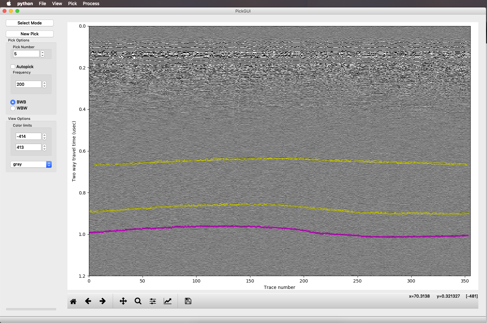
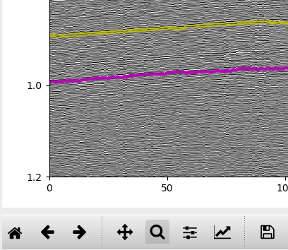
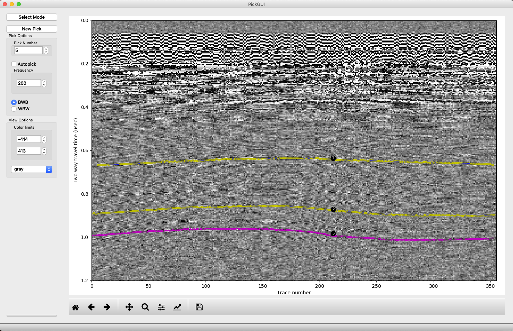
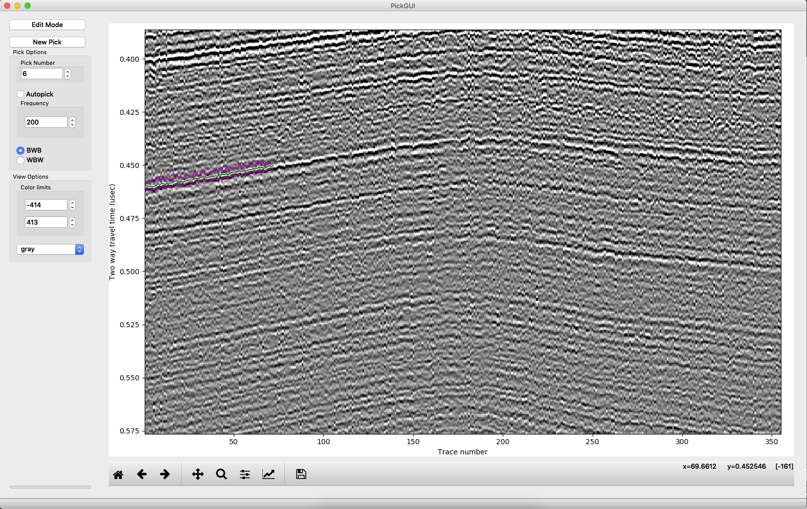
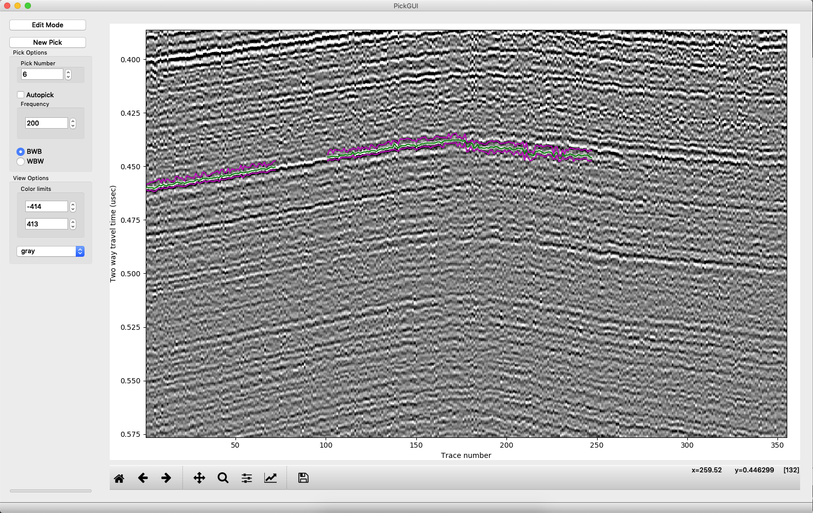
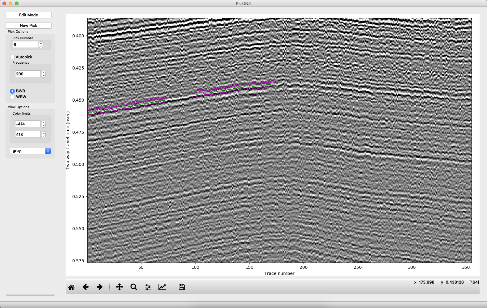

=======
imppick
=======

Command-line call
=================
.. code-block:: bash

    imppick [-h] [-xd] [-yd] fn

Positional Arguments
--------------------
+----+---------------------+
| fn | The file to process |
+----+---------------------+

Named Arguments
---------------
+-----+--------------------------------------------------------------------------+
| -xd | Use kilometers for the x-axis                                            |
+-----+--------------------------------------------------------------------------+
| -yd | Use depth in meters (or elevation if elevation-corrected) for the y-axis |
+-----+--------------------------------------------------------------------------+

After calling imppick to bring up the GUI, things should be pretty intuitive, but navigation may seem a bit odd at first. Here is the basic view of the picker on a Mac:

In this profile, I've picked some layers already. The active pick is highlighted in magenta (or rather the top and bottom of the packet are in magenta, and the middle of the packet is green, but the middle is not visible at this zoom). Other picks are in yellow, surrounding a blue central peak. On the left side are most of the controls for when do the picking. We'll go through the buttons on the left, from top to bottom, to get an idea of how picking proceeds.

Menus
=====
Modes
-----
The mode is displayed in a button in the upper left. We have two modes: select mode, for deciding what to modify, and edit mode, to change the picks. **Neither mode works when the matplotlib pan/zoom toolbar is active (shown below). Reclick the zoom or pan button so it is unselected if you want to use the ImpDAR functions.**

Select
______
Select mode allows us to choose which of the picks to add to. This is used to go back to old picks that already exist and modify them. If there are no picks yet, or if we want a new pick, we can go straight to edit mode.

Edit
____
Edit mode is where you will spend most of your time. In edit mode, you can modify the existing picks, either deleting from the, renumbering them, or adding to them.

Pick Options
------------
This is where we control things about how the picking algorithm operates.

Pick Number
___________
Changing this integer will change the number associated with this pick. This changes nothing about how the data are stored (i.e. you can choose pick 999 without making a big empty matrix waiting for picks 1-998), and only affects wheat we call it (and it will be exported with the number of your choice). By convention, StODeep used 99 for the bed pick. Trying to set the number to something that is already used is not allowed--ImpDAR will increment to an unused pick. If you want to switch the numbering of two picks, you should set one to something unused, move the second to the first, then the first into the second's old place.

Autopick
________
Right now, this checkbox is inactive. If we can successfully implement a decent autopicking algorithm, this will get turned on. For now, if you want to try to make ImpDAR do the work for you, try picking the leftmost and the rightmost trace.

Frequency
_________
This should, in general, be the frequency of the radar system. It sets the wavelet size that we try to correlate with each radar trace when picking. You probably want to update this once at the start of picking, then leave it alone.

Polarity
________
Choose whether you are picking layers that go +-+ or -+-. In a grayscale colorbar, these BWB and WBW respectively.

New Pick
--------
After we have selected our picking options, we probably want to do some picking. Clicking the "New pick" button adds a pick with an unused pick number (you can modify it at any time though).

View Options
------------
These options control aspects of coloring the radargram; zooming and panning are handled directly by matplotlib in the bottom toolbar.

Color limits
____________
The color limits are fairly self explanatory. Change this to increase or decrease contrast.

Color map
_________
This is again self explanatory. Change the colormap as desired to improve the visualization. CEGSIC is a custom map intended for radar data and developed at St. Olaf. All other maps just link to matplotlib.

Workflow
========
Load intersections
------------------
Once the profile is loaded, before doing any picking or numbering, you likely want to have the context of any other profiles that you have already picked. This is done through `pick > load crossprofile`. Loading the intersections should give you a string of pearls with pick numbers in each, with the dots located at where the other profile hits this one. The loading is pretty dumb, so if you have multiple intersections only the one where the traces in the two profiles are closest will load. Eventually this might become more clever, but the current implementation covers most use cases. You can load multiple profiles, so if you are really having a need for multiple intersections, just split the other file.

Picking
-------
To begin picking, make sure you are in "edit" mode and that neither pan nor zoom is selected. If there are already some picks on the profile, you first will want to create a new pick. Picking a section must be done from left to right. You can skip portions by "NaN picking", then continue to the right and go back and fill in gaps later to fill in gaps. To pick, start with a left click on the layer at the left edge of the profile. After you click a second time, you should start to see the layer plotted. You should not try to pick too far away--ImpDAR will search for a reflection with the desired polarity within a certain distance, determined by the frequency, of the line connecting your clicks. If you try to make it pick through too much variability, it can miss peaks and troughs.

Now, let's say you come to a portion of the profile that you feel is ambiguous and you want to skip it. Pick up to the left side of it, then click on the right side while holding down "n". Continue clicking to the right as normal, and you will see that the portion left of where you clicked with "n", i.e. where you NaN picked, is blank.

Now suppose you screwed up, like in the image above where it looks like you stepped down to a deeper layer by mistake, so now you want to backtrack. Right clicking will delete all picks left of the last click (generally the right end of the profile) and right of the right click.

We can also go back and edit a previous pick, moving it up, say. We can also delete picks in the middle of a profile by left clicking at the right edge of the span we are deleting, then right click at the left edge.

Saving
------
After picking, you need to save your picks. When you close the window, you will be prompted to save. You can also save at any time through the file menu in the upper left. If you just want to save an image of the figure, you can use the disk icon in the matplotlib toolbar or you can use the `file > save figure` from the menus. You can also export the picks as a csv file (no gdal required) or as a shapefile (needs gdal) from the `pick > export` menu.
