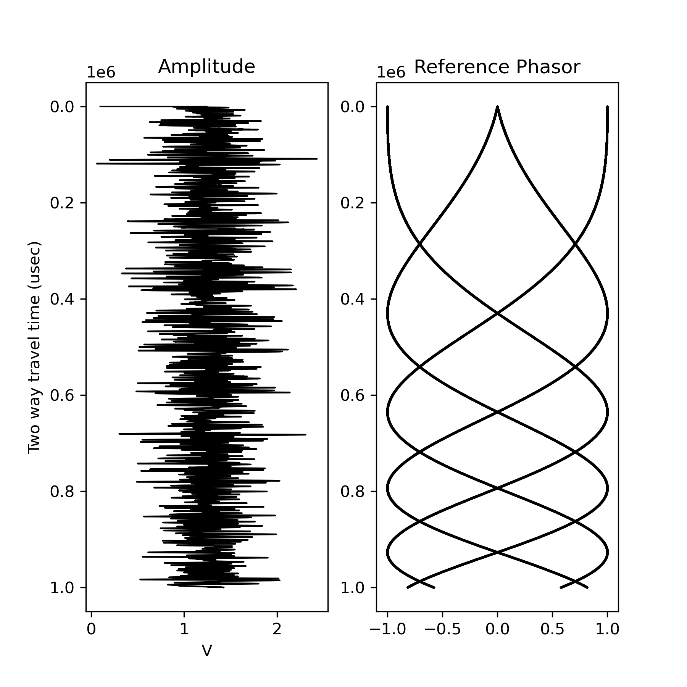
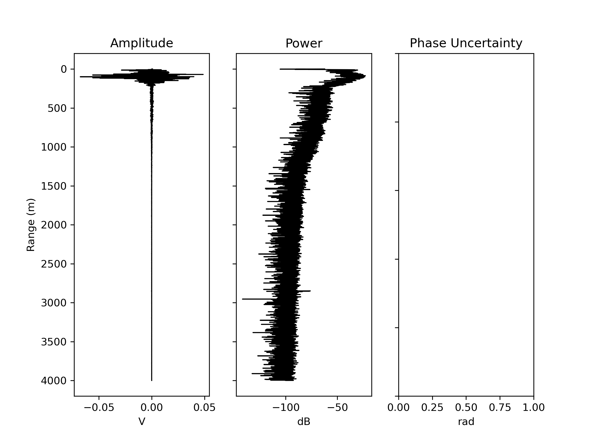
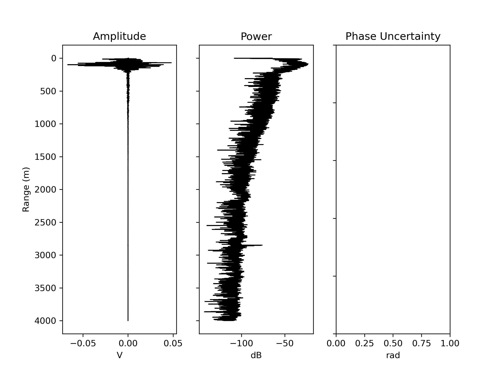
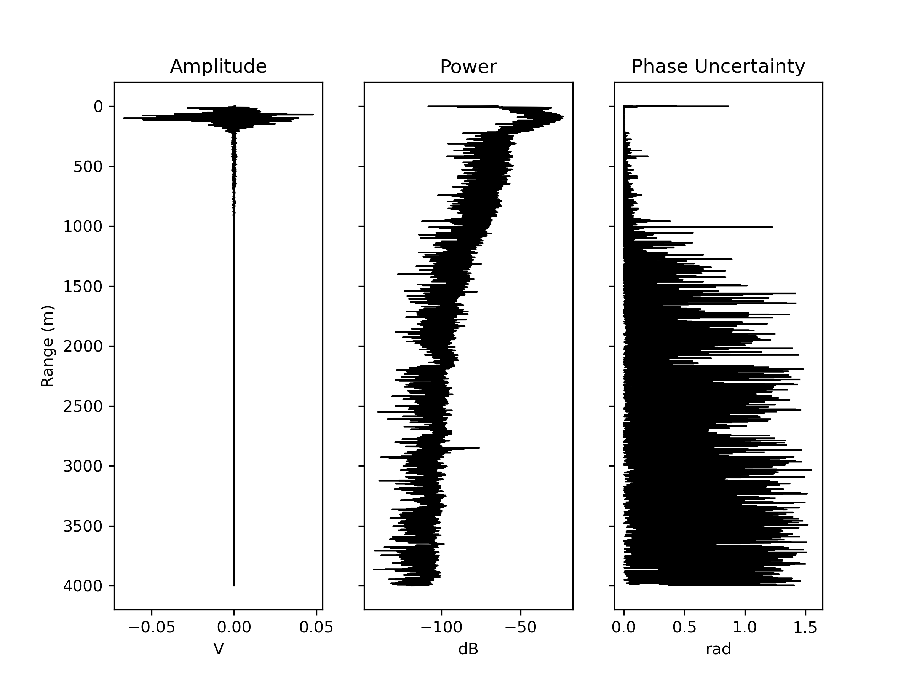
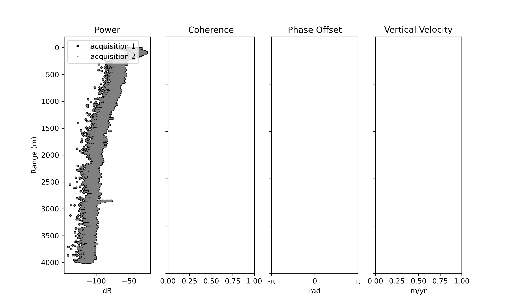
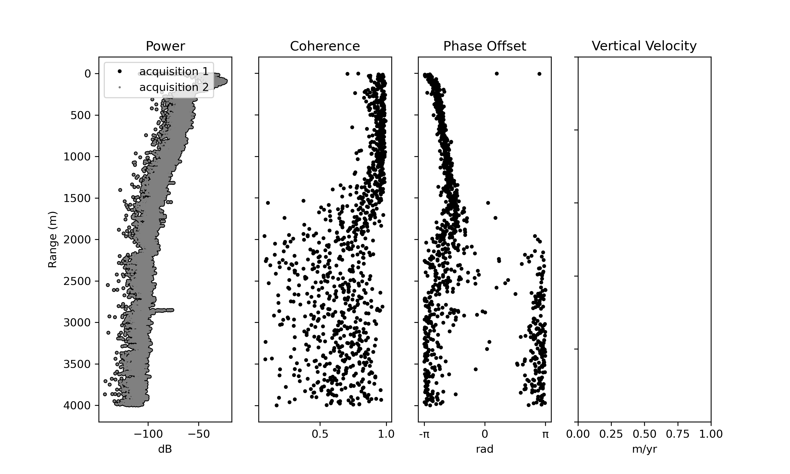
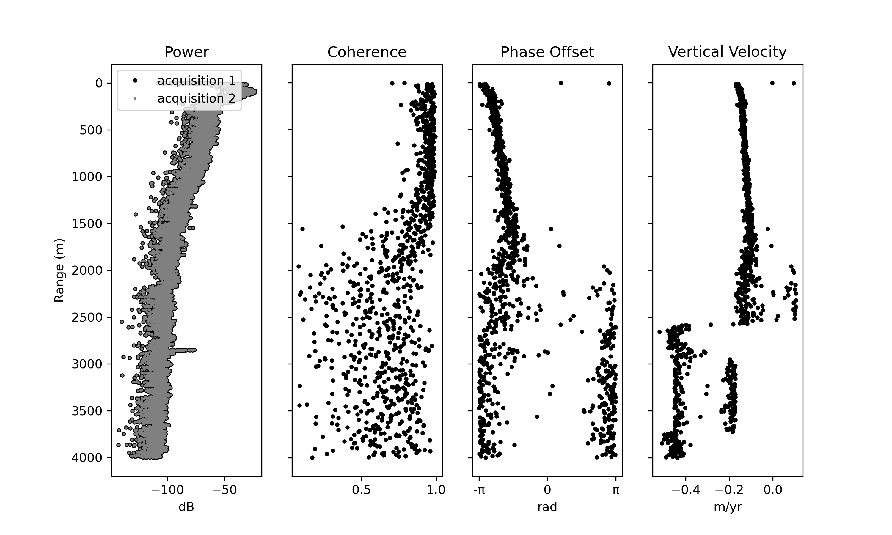

Apres Radar (apdar) examples
===================

``apdar`` is the ApRES (Autonomous phase-sensitive Radio Echo Sounder) module for ImpDAR. Most of the source code originally came from Matlab scripts written at BAS, and credit is given to those scripts where appropriate.

apdar load
-------

With ``apdar load``, you can import an ApRES data file from one of several formats (.mat, .hdf5, .nc, .DAT, .dat). The load scripts will determine the data type for you and assign appropriate fields to an apres data object. The raw data do not mean much, but you can make sure that some data are written to the file at least by plotting, ``apdar plot apres_apraw.mat``,

apdar processing
-------

``apdar range apres_apraw.mat``

This does a range conversion (pulse compression) using the known transmit chirp which is written into the file header. Now we have range and can plot amplitude or power against it, more like a traditional radar A-scope image, ``apdar plot apres_range.mat``,

This is only plotting the first chirp whereas the file will have many chirps in each burst and typically many bursts as well. To stack the chirps use,

``apdar stack apres_range.mat``

 By default, this function assumes that you want to stack everything across all bursts. If not, tell it how many chirps you want to stack with ''-num_chirps''.

Calculate the complex uncertainty for each sample using,

``apdar uncertainty apres_range_stacked.mat``

This looks at samples below a given range (3000 by default) to determine a 'median noise phasor' which is used to calculate the uncertainty for each sample by comparing them to the noise phasor.

apdar time difference loading
-------

With ``apdar load -acqtype timediff apres_1.mat apres_2.mat``, you can load two ApRES acquisitions side-by-side in order to difference them for a vertical velocity calculation. This only takes .mat or .hdf5 files as input, and those files should be stacked and range converted beforehand.

apdar difference processing
-------

``apdar pdiff apres_tdraw.mat``

This command calculates the phase coherence between the two acquisitions.

``apdar diffproc apres_tdraw.mat``

This command walks through the entire processing flow for differencing two ApRES acquisitions.

