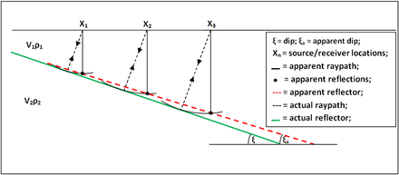
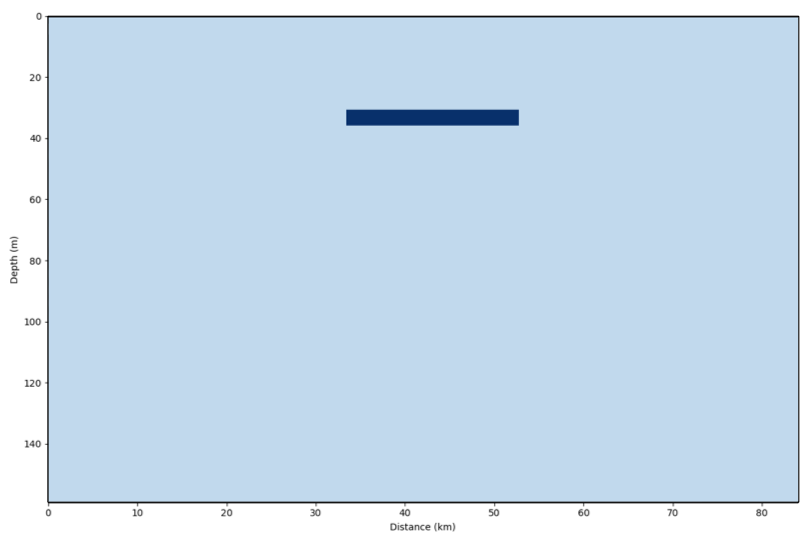
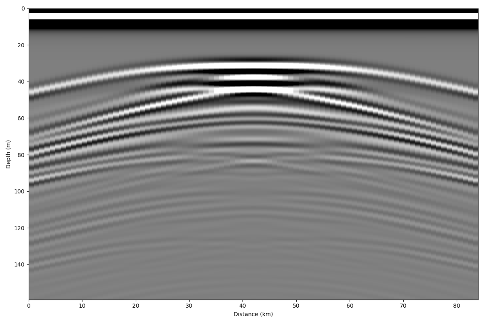
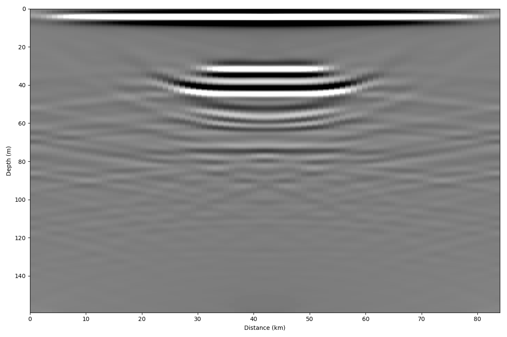
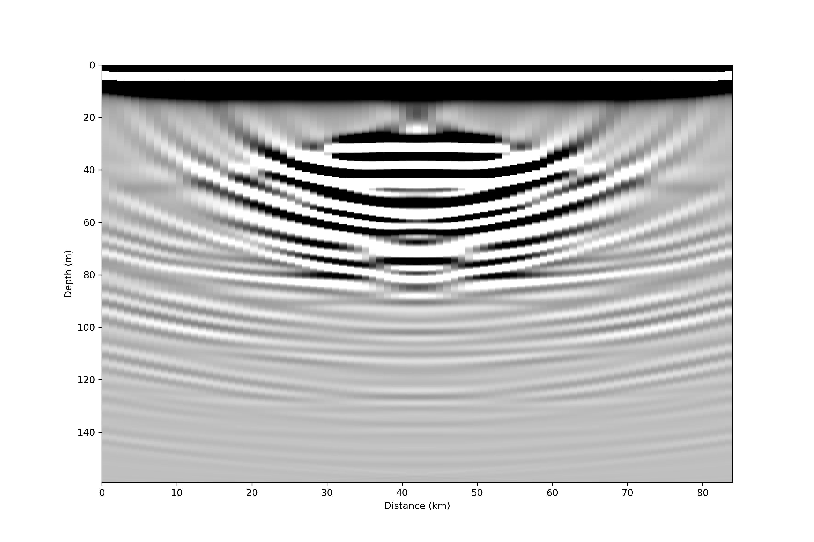
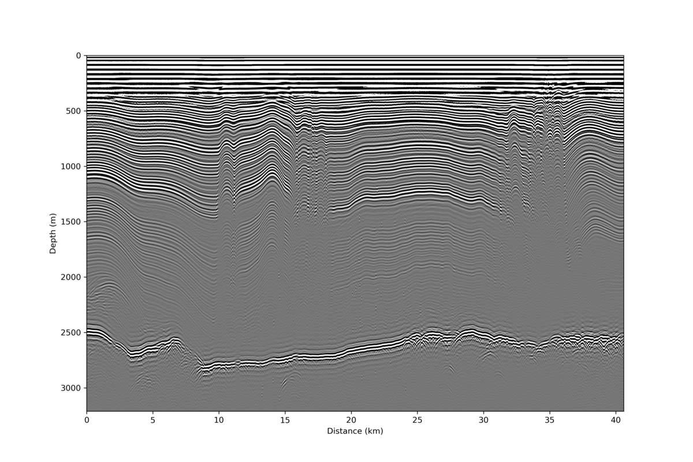
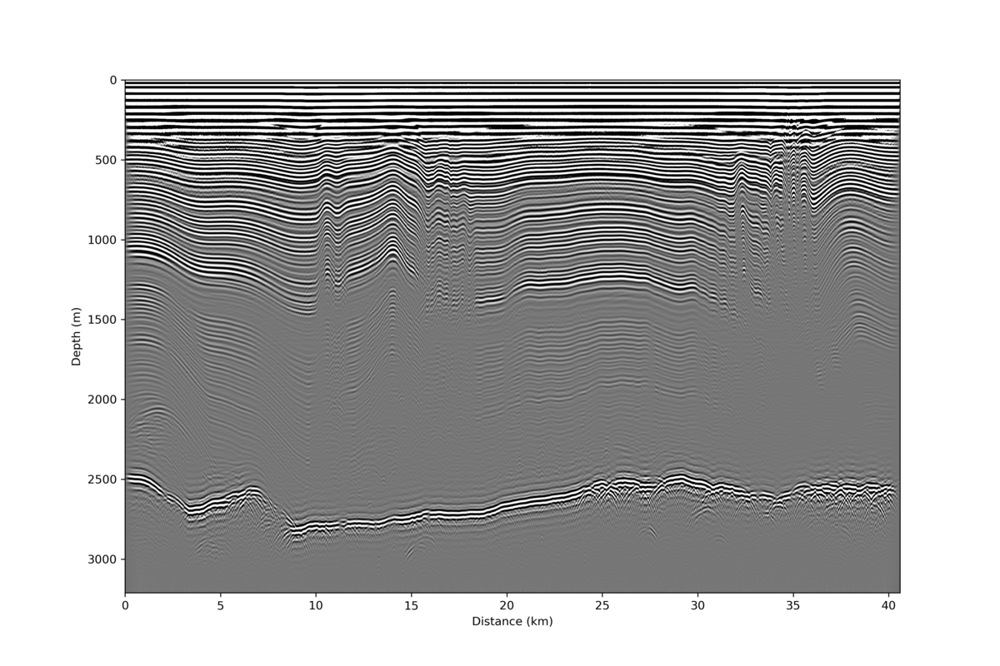

Migration
=========
What is Migration?
------------------

The goal of migration is to transform a geophysical dataset (typically seismic data but in this case radar) into an image that accurately represents the subsurface stratigraphy. Migration is a mathematical transformation in which geophysical events (timing of wave return) are re-located to where the event (the reflection) occurred in the subsurface rather than the time at which it was recorded by the receiver at the surface. Because off-nadir information intrudes into each trace, the image must be migrated as a whole to describe the true reflector geometry. Migration adjusts the angle of dipping reflectors, shortens and moves reflectors updip, unravels bowties, and most generally collapses diffractions. 

The migration problem is illustrated in the image above. Dipping reflectors are imaged by an off-nadir (‘apparent’) reflection. The ray path of the apparent reflection is not the same as the depth of the reflector directly below the source. The migrator’s equation is a simple analytic way to adjust the angle of a dipping reflector,

.. math:: 
    tan(\xi_a) = sin(\xi)

where :math:`\xi` is the true reflector dip and :math:`\xi_a` is the apparent dip shown in the unmigrated image. While this equation is useful, it does not provide the full capability of migrating the entire image. To do that, we explore a few different methods below. 

*Note: migration typically assumes coincident source and receiver, meaning that this processing step should be carried out after any stacking or move-out (nmo) corrections.*

Synthetic Example
-----------------

Here, we create a synthetic domain to use as an example for the ImpDAR migration routines. For this case, the permittivity is elevated within the dark blue box in the image below (:math:`\epsilon_r=12` inside and :math:`3.2` for ice outside). 

Loading this domain into gprmax (a finite-difference time-domain modeling software), we simulate a common-offset radar survey over the box with the output as a synthetic radargram. The source is a 3-MHz wave from a Hertzian Dipole antenna. Source-receiver antenna separation is 40 m, and the step size between traces is 4 m. 

This synthetic image illustrates why we need to migrate. There are large hyperbolae that extend away from the actual location of the box in both horizontal directions. These hyperbola, or diffraction curves, do not accurately represent the subsurface stratigraphy, they are only a result of imaging the box from the side as an off-nadir reflector. 

Kirchhoff Migration
___________________

The first migration method that we use here is the most direct to explain conceptually. Originally (~1920’s), geophysical datesets were migrated by hand, and this method follows the logic used then. The energy is integrated along each diffraction curve and placed at the apex of the curve (Hagedoorn, 1954). The diffraction curves are expected to be hyperbolic (in a constant velocity medium they will be), so here we iterate through each point of the image, looking for a hyperbolic diffraction curve around that point and integrating the power along it.

``impdar migrate --mtype kirch synthetic.mat``

.. image:: ./migration_figures/synthetic_migrated_kirch.png

Now we can see the box in its original location (i.e. ~30-55 km lateral distance and ~30 m depth). This method seems to work, but it is slow (even for this small synthetic dataset) and it ‘over migrates’ through much of the domain as can be seen by the upward facing hyperbola ('smileys') around the edges and below the box.

Summary of Kirchhoff Migration: 

• Strengths - Conceptually simple, Migrates steeply dipping reflectors.

• Weaknesses - Slow, Over migrates, No lateral velocity variation.

Stolt Migration
_______________

Migration is most commonly done in the frequency domain. In this case, the transformation is one from vertical frequency (:math:`\omega_z`) to vertical wavenumber (:math:`k_z`); thus, these migration routines are grouped as 'frequency-wavenumber' routines. The transformation is done in the frequency domain, so a 2-D Fourier transform is used before the migration and an inverse Fourier transform after. There are many such migration routines; here I highlight a couple popular ones which have been implemented in ImpDAR.

The first, and probably the simplest, of the frequency-wavenumber migration routines is 'Stolt Migration'. Stolt Migration is done over the entire domain simultaneously, so it requires the assumption of a constant velocity throughout. The transformation is

.. math::
    P(x, z, t = 0) = \int \int \left [ \frac{v}{2} \frac{k_z}{\sqrt{k_x^2+k_z^2}} \right ] P \left ( k_x, 0, \frac{v}{2} \sqrt{k_x^2 + k_z^2} \right ) e^{−ik_x x−ik_z z} dk_x dk_z

where an interpolation is done from :math:`\omega_z` to :math:`k_z` in frequency-space. The routine is implemented in ImpDAR as,

``impdar migrate --mtype stolt synthetic.mat``

Stolt migration is great in places where the velocity is known to be constant. It is quite a bit faster than the other routines. Here though, we need to be careful about migrating power in from the edges of the domain, as can be seen in the lower corners above. For this reason, we apply a linear taper to the data so that the Fast Fourier Transform has a smooth transition from data to the zeros that it fills in around the edges.

Summary of Stolt Migration:

• Strengths – Fast, Resolves steeply dipping layers.

• Weaknesses – Constant velocity.

Phase-Shift Migration
_____________________

The second frequency-wavenumber migration routines is actually a set of a few called phase-shift migration (sometimes Gazdag migration). A phase-shifting operator :math:`eˆ{-ik_z z}` is applied at each z-step in downward continuation. These methods are advantageous in that they allow variable velocity as one steps down. Generally, this only allows vertical velocity variation but there is also a case which accomadates lateral velocity variation (phase-shift plus interpolation).

``impdar migrate --mtype phsh synthetic.mat``

Constant velocity phase-shift migration is the default in ImpDAR, so it can also be called as,

``impdar migrate synthetic.mat``

.. image:: ./migration_figures/synthetic_migrated_phsh.png

Much like the result from Kirchhoff migration, we see upward dipping ‘smileys’ in this migrated image.

Summary of Phase-Shift Migration:

• Strengths – Accomodates velocity variation (particularly appropriate for vertical variations, i.e. in snow/firn or similar).

• Weaknesses – Maximum dip angle.

SeisUnix Migration Routines
___________________________

There are many migration routines implemented in the seismic processing package, SeisUnix. With ImpDAR, we have no intent to replicate the work that they have done; instead, we allow the user to easily convert radar data to .segy, migrate with SeisUnix, then convert back, all in a kind of black-box fashion with only one command. If SeisUnix is not installed, this command with raise an error. 

``impdar migrate --mtype sumigtk synthetic.mat``

Data Example
------------

Below is a real example of migration in ImpDAR for 3-MHz ground-based data from the Northeast Greenland Ice Stream (Christianson et al., 2014).

Unmigrated Data:

Stolt:

Phase-Shift:

SeisUnix T-K:

References:

Yilmaz (2001). Seismic Data Processing.

Sherrif and Geldart (1995). Exploration Seismology.

Hagedorn (1954). Seismic Imaging Migration.

Stolt (1978). Migration by Fourier Transform. *Geophysics*

Gazdag (1978). Wave Equation Migration with the Phase-Shift Method. *Geophysics*

Christianson et al. (2014). Dilatant till facilitates ice-stream flow in northeast Greenland. *Earth and Planetary Research Letters.*
