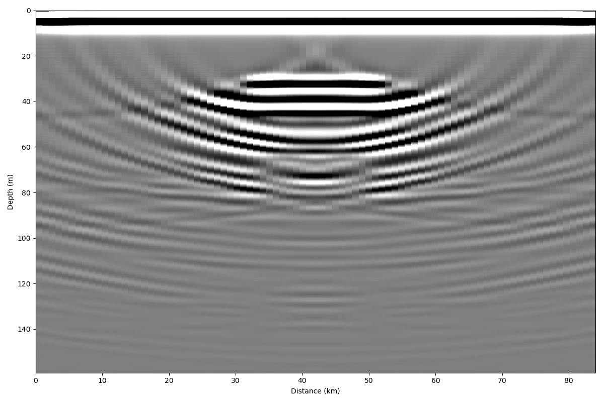
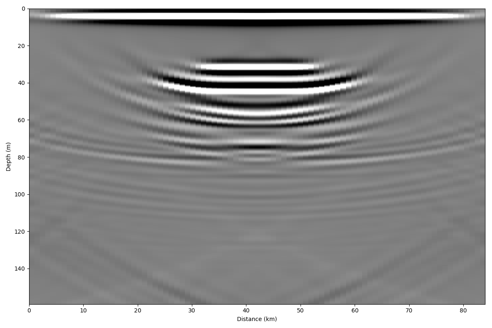

What is Migration?
===================

The goal of migration is to transform a geophysical dataset into an image that accurately represents the subsurface stratigraphy. Migration is a mathematical transformation in which geophysical events (timing of wave return) are re-located to where the event (the reflection) occurred in the subsurface rather than the location that it was recorded at the surface. Because off-nadir information intrudes into each trace, the image must be migrated as a whole to describe the true reflector geometry. Migration adjusts the angle of dipping reflectors, shortens and moves reflectors updip, unravels bowties, and most generally collapses diffractions. The migration problem is illustrated in the image above. Dipping reflectors are imaged by an off-nadir (‘apparent’) reflection. The ray path of the apparent reflection is not the same as the
depth of the reflector directly below the source. The migrator’s equation is a simple analytic way to adjust the angle of a dipping reflector,
tan(ξa) = sin(ξ)
where ξ is the true reflector dip and ξa is the apparent dip shown in the unmigrated image. While this equation is useful, it does not provide the full capability of migrating a full geophysical image. To do that, I explore a few different methods below. As a note: migration typically assumes coincident source and receiver, meaning that this processing step should be carried out after any stacking or move-out corrections.

Migration methods outlined below:
• Diffraction Stack Migration (i.e. Kirchhoff)
• Frequency-Wavenumber Migration (e.g. Stolt, Gazdag, etc.)
• Finite-Difference Migration
• SeisUnix Migration Routines (ImpDAR converts to .segy, does the migration in SU, then
converts back)

Synthetic Example
===================

Here, I create a synthetic domain to use as an example for the ImpDAR migration routines. For this case, the permittivity is elevated (εr = 12 inside and 3.2 outside) within the dark blue box in the image below. Loading this domain into gprmax (a finite-difference time-domain modeling software), I simulate a common offset radar survey over the box with the output as a synthetic radargram. The source is a 3-MHz wave from a Hertzian Dipole antenna. Source-receiver antenna separation is 40 m, and the step size between traces is 4 m.

.. image:: synthetic.png

This synthetic image illustrates why we need to migrate. There are large hyperbola that extend away from the actual location of the box in both horizontal directions. These hyperbola, or diffraction curves, do not accurately represent the subsurface stratigraphy, they are only a result of imaging the box from the side as an off-nadir reflector. 
As a note: The domian is slightly different because gprMax needs some room around the edges for a ‘perfectly matched layer’ boundary condition.

Kirchhoff Migration
--------------------

The first migration method that I use here is the most direct to explain conceptually. Originally (~1920’s), geophysical datesets were migrated by hand, and this method follows the logic used then. The energy along each diffraction curve is summed and placed at the apex of the curve (Hagedoorn, 1954). The diffraction curves are expected to be hyperbolic (in a constant velocity medium they will be), so here we iterate through each point of the image, looking for a hyperbolic diffraction curve and integrating the power along it.

``impdar migrate --mtype kirch synthetic.mat``

Now we can see the box in its original location (i.e. ~200-300 lateral distance and ~0.5-1.0 μs). This method seems to work, but it is slow (even for this small synthetic dataset) and it ‘over migrates’ through much of the domain as can be seen by the upward facing hyperbola around the edges and below the box.
Summary of Kirchhoff Migration: - Strengths - Conceptually simple. - Migrates steeply dipping reflectors. - Weaknesses - Slow. - Over migrates. - No lateral velocity variation.

We don't often use this routine...

Stolt Migration
--------------------

Migration is commonly done in the frequency domain. In this case, the transformation is one from
vertical frequency (ωz) to vertical wavenumber (kz). This transformation is done in the frequency
domain, so a 2-D Fourier transform is used in these methods. There are many such migration
routines; here I highlight a couple popular ones.

This is the first and probably the simplest of the frequency-wavenumber migration routines. It is
done over the entire domain simultaneously, so it requires the assumption of a constant velocity
throughout. The transformation done here is

P(x, z, t = 0) = ∫ ∫ [v2√kzk2x + k2z]P(kx, 0, v/2√k2x + k2z) e −ikx x−ikz z dkxdkz

where an interpolation is done from ωz to kz in frequency-space.

``impdar migrate --mtype stolt synthetic.mat``

.. image:: synthetic_migrated_stolt.png

Stolt migration is great in places where the velocity is known to be constant. It is quite a bit faster than the other routines. Here though, we need to be careful about migrating power in from the edges of the domain, as can be seen in the lower corners above. For this reason, we apply a linear taper to the data so that the Fast Fourier Transform being used does not instantaneously switch from data to zeros around the edges.
Summary of Stolt Migration:
• Strengths
– Fast.
– Resolves steeply dipping layers
• Weaknesses
– Constant velocity.

Phase-Shift Migration
-----------------------

This second frequency wavenumber migration routines is actually a set of a few. A phase-shifting operator $eˆ{-ik_z z} is applied at each z-step in downward continuation. These methods are advantageous in that they allow variable velocity as one steps down. Generally, this only allows vertical velocity variation (which I explore here) but there is also a case which accomadates lateral velocity variation (phase-shift plus interpolation) which I will not describe here.

``impdar migrate --mtype phsh synthetic.mat``

Much like the result from Kirchhoff migration, we see upward dipping ‘smileys’ in this migrated image.

Summary of Phase-Shift Migration:
• Strengths
– Accomodates velocity variation (particularly appropriate for vertical variations, i.e. in
snow or similar).
• Weaknesses
– Maximum dip angle.

SeisUnix Migration Routines
----------------------------

There are many migration routines implemented in SeisUnix. I have no desire to replicate the
work that they have done, but I wrote something into ImpDAR that allows the user to easily
convert their data to .segy, migrate with SeisUnix, then convert back, all in a kind of black box
fashion with only one command.

``impdar migrate --mtype sumigtk synthetic.mat``

Data Example
===================

With ``impproc migrate``, you can perform a number of processing steps in a single line. We are starting with data in crossprofile.mat.

.. image:: crossprofile.png

This profile does not have anything above the first return; often we would have started recording earlier and have some samples that we would want to delete off the top to start. There is a lot of variability in the overall return power in different traces (resulting from the data collection, not from sub-surface variability). There is also a lot of noise. To vertically bandpass the data between 200 and 600 MHz, adaptively horizontally filter, stack 3 traces, and do a normal moveout correction with no transmit-receive separation only requires running

``impdar proc -vbp 200 600 -ahfilt -restack 3 -nmo 0 1.69 crossprofile.mat``

and then the output is saved in crossprofile_proc.mat.

.. image:: crossprofile.png
