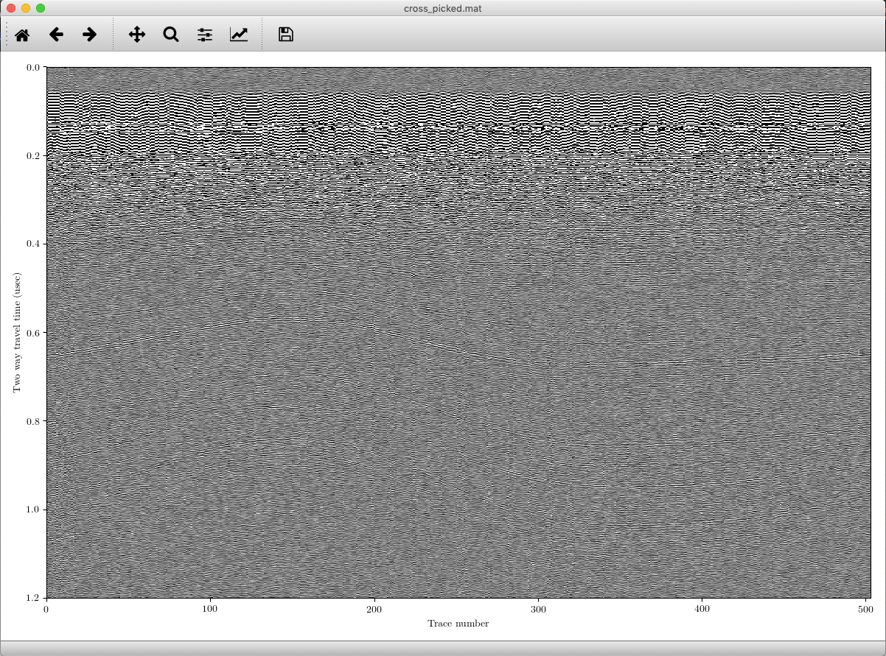
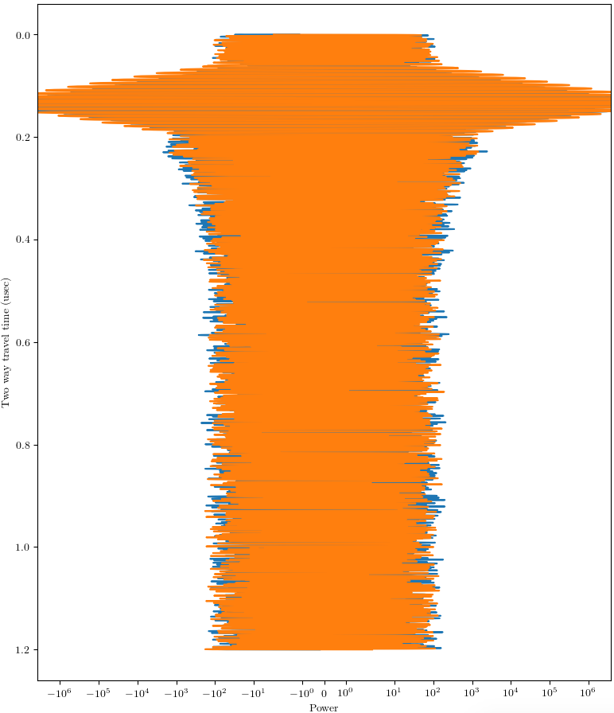
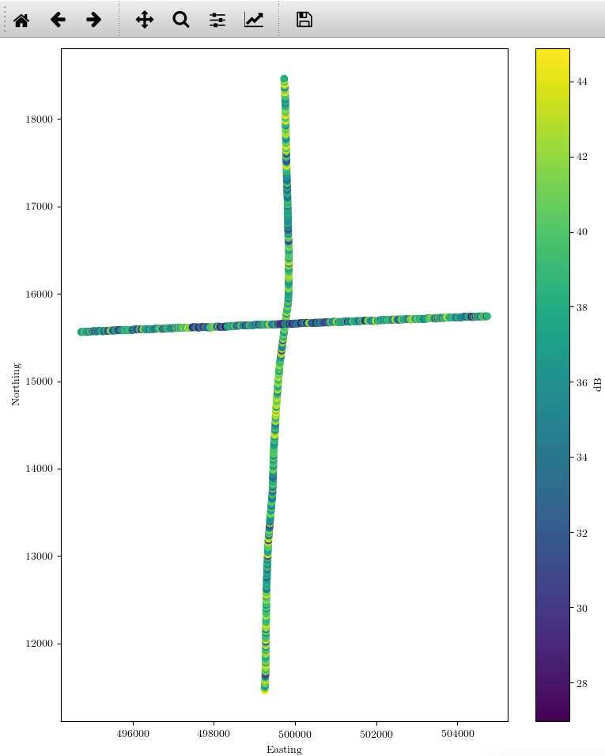
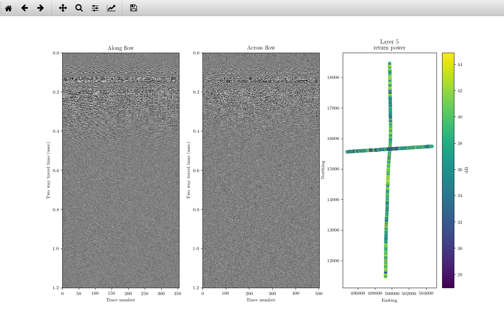

=================
Plotting examples
=================

Visualizing output is an essential piece of processing and the disseminating radar data. You likely will need to look at the output many times so that you can discern the effect of different processing steps, and then you will likely want to make a figure at the end. With these two use cases in mind, ImpDAR provides both command-line plotting, for quick and easy visualization, and API calls more customized plots.

impplot
=======
ImpDAR permits you to make plots by calling :code:`impdar plot [fns]` with a few options, but I recommend using :code:`impplot` instead. The syntax is cleaner and it is more clear what you are doing. There are different types of plots you can make with :code:`impplot`, described below, but it is first worth noting you can always add the :code:`-s` directive to save the output to a file rather than pulling it up in a matplotlib figure window.

radargram
---------

The most common thing to plot is probably the full radargram. The basic syntax is :code:`impplot rg [fns]`, with additional options described with :doc:`../bin/impplot`. When you run :code:`impplot rg` you will get something like this popping up in an interactive window.

You can pan and zoom around the plot, and determine what other processing steps you might want to take. You can this with multiple filenames and get a group of plots. If there are picks in the file, these will be displayed as well, though you can deactivate this feature with :code:`-nopicks`.

traces
------
Sometimes you may want to look at how the samples in an individual trace, or group of traces, vary with depth. A range of traces can be plotted with :code:`impplot [fns] trace_start trace_end`. The output is something like this.

power
-----
This command is used to look at the variability in reflected power in space. You will get a single plot with the return power of a given layer in all the different profiles called. The syntax is :code:`impplot [fns] layer`. If there are projected coordinates, those will be used, and otherwise you are stuck with lat/lon. The result for two crossing profiles might look something like this.

API
===
There are several reasons you might want to use an API call rather than :code:`impplot`: perhaps want to modify the output, perhaps by annotating it or plotting on top of it; you may want to put a panel made by ImpDAR in a figure with other subplots; or maybe you just need to have multiple panels plotted by ImpDAR. Regardless, in these cases I would recommend loading up the data then using the explicit plotting functions in :doc:`the plotting library<\../lib/Plotting>`. I'll just give an example of a several-panel plot with all panels produced through ImpDAR. Say you want to make a 3-panel plot showing two profiles and the power returned from both. You could use

.. code-block:: python

    import matplotlib.pyplot as plt
    from impdar.lib import RadarData, plot

    # Load the data we are using; in this case they are already processed
    profile_1 = RadarData.RadarData('along_picked.mat')
    profile_2 = RadarData.RadarData('cross_picked.mat')

    # Make the figure we will plot upon--need some space between axes
    fig, (ax1, ax2, ax3) = plt.subplots(1, 3, gridspec_kw={'hspace': 1.0}, figsize=(12, 8))

    # plot the two radargrams
    plot.plot_radargram(profile_1, fig=fig, ax=ax1)
    plot.plot_radargram(profile_2, fig=fig, ax=ax2)

    # Now look at their return power in space on layer 5
    plot.plot_power([profile_1, profile_2], 5, fig=fig, ax=ax3)

    #document what we are looking at
    ax1.set_title('Along flow')
    ax2.set_title('Across flow')
    ax3.set_title('Layer 5\nreturn power')
    
    
    # see how it turned out
    plt.show(fig)

And this will produce a nice 3-panel figure (though we would certainly want to do a better job with reasonable aspect ratios for most applications).

