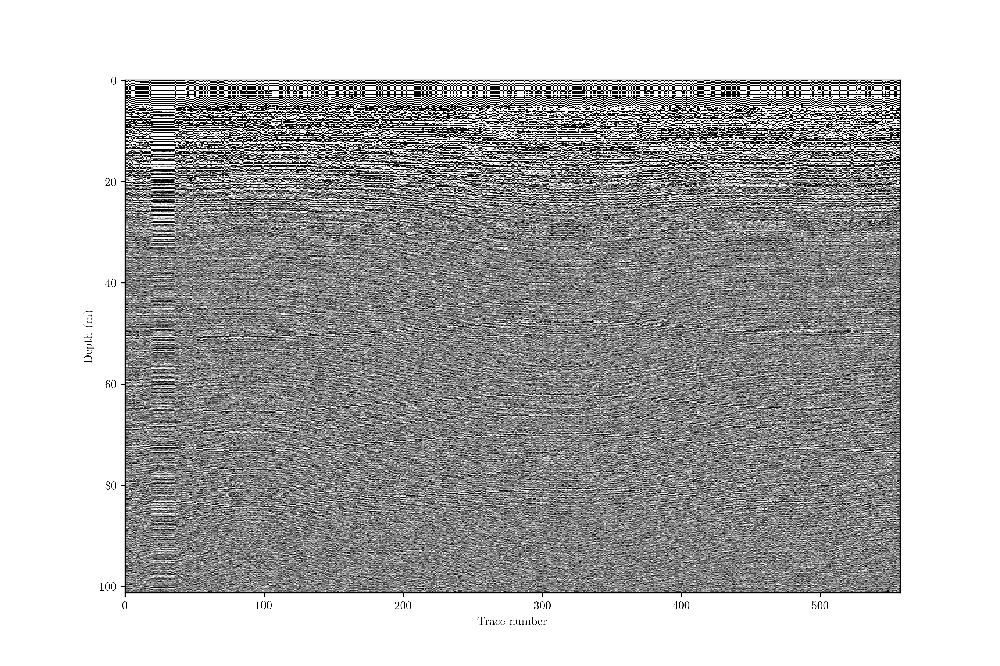
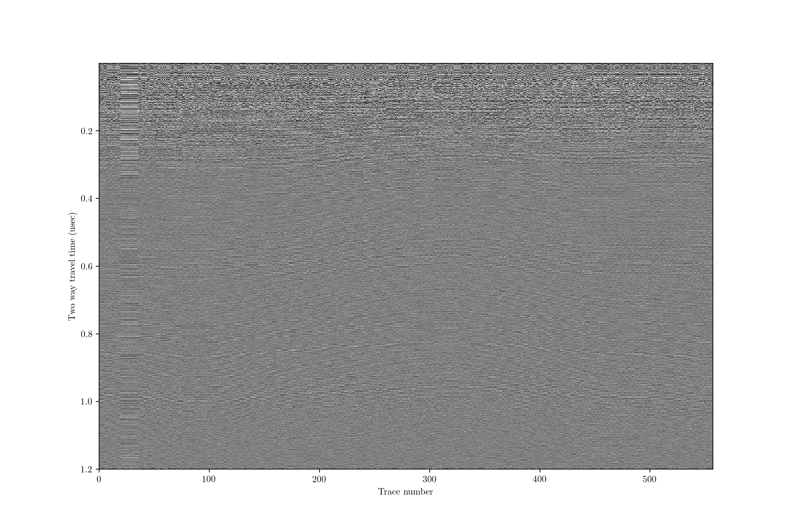
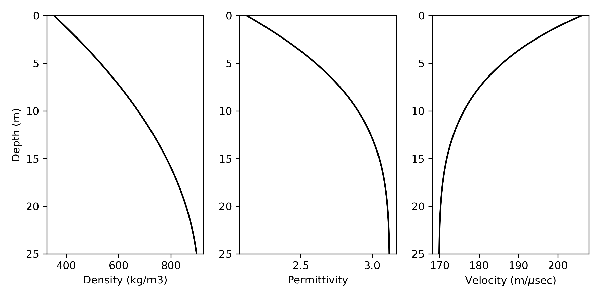
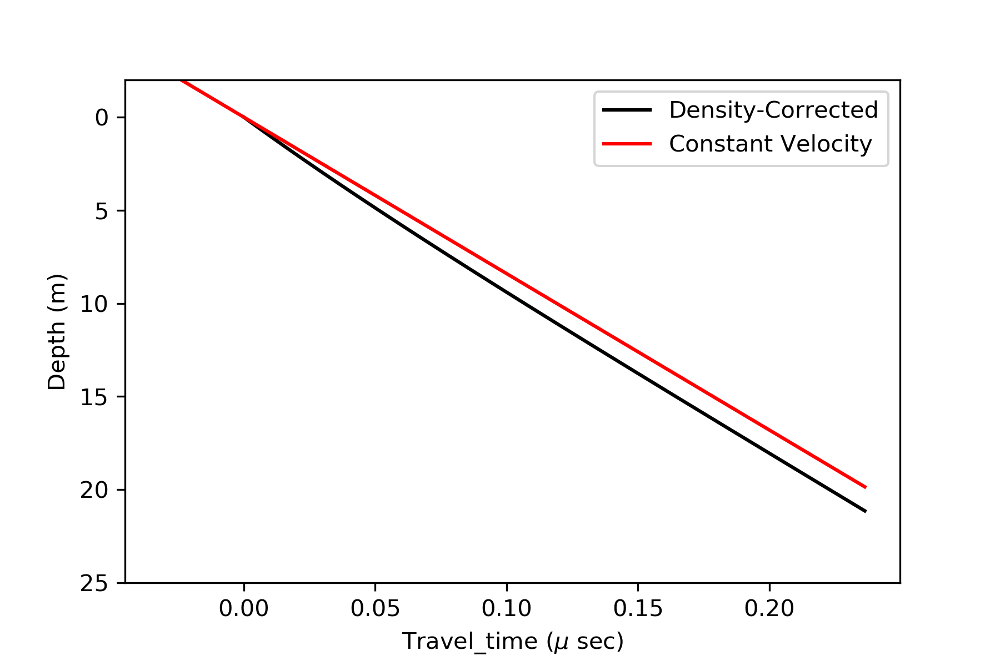
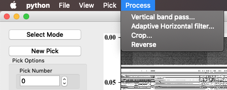
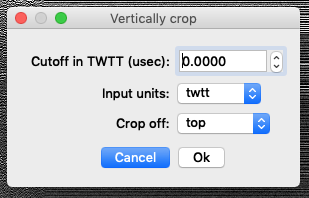

Processing examples
===================

There are three main options for processing. The first is using ``impdar proc`` with options in order to do multiple processing steps. ``impproc`` allows simpler syntax and greater flexibility, but only can apply one processing step at a time. Finally, there are processing options within the pick GUI that allow you to see the effects of the steps immediately, though replotting can be expensive for large datasets and batch processing with the GUI is not possible.

impdar proc
-----------

With ``impdar proc``, you can perform a number of processing steps in a single line. We are starting with data in crossprofile.mat.

.. image:: crossprofile.png

This profile does not have anything above the first return; often we would have started recording earlier and have some samples that we would want to delete off the top to start. There is a lot of variability in the overall return power in different traces (resulting from the data collection, not from sub-surface variability). There is also a lot of noise. To vertically bandpass the data between 200 and 600 MHz, adaptively horizontally filter, stack 3 traces, and do a normal moveout correction with no transmit-receive separation only requires running

``impdar proc -vbp 200 600 -ahfilt -restack 3 -nmo 0 1.69 crossprofile.mat``

and then the output is saved in crossprofile_proc.mat.

impproc
-------

``impproc`` provides a bit cleaner syntax than ``impdar proc`` but accomplishes the same tasks. It is often useful to see the effect of each processing step individually, and ``impproc`` gives named outputs for each step that allow easy identification and organization. We will use the same example as above, starting with this raw data in crossprofile.mat

.. image:: crossprofile.png

First, lets do some vertical filtering. As before, we will vertically bandpass with a 5th-order forward-backward Butterworth filter from 200 to 600 MHz.

``impproc vbp 200 600 crossprofile.mat``

This gives an output in 'crossprofile_bandpassed.mat'. We can see that this has removed most of the noise.

.. image:: crossprofile_bandpassed.png

We still probably have some noise coming in horizontally (e.g. long-wavelength changes in return power due to our batteries draining in the radar controller). To remove this, we can remove something akin to the average trace.

``impproc ahfilt crossproile_bandpassed.mat``

Which gives us 'crossproile_bandpassed_ahfilt.mat'. This looks about the same, though layers have become slightly more clear.

.. image:: crossprofile_bandpassed_ahfilt.png

Since layer slopes are small, we have lots of extraneous data. We can restack to reduce noise a bit more and reduce filesize.

``impproc restack 3 crossprofile_bandpassed_ahfilt.mat``

The output is in 'crossprofile_bandpassed_ahfilt_restacked.mat'. Again, this looks about the same, but we have reduced the filesize by about a factor of 3.

Now we want to look at this in terms of depth. We are going to do this with a constant vertical velocity. This particular data was collected with GSSI radar with a single transmit/receive antenna, so there is no need to do any geometric correction for the triangular pattern of transmit/receive that we would get with spatially separated antennas (like many HF systems have).

``impproc nmo 0 crossprofile_bandpassed_ahfilt_restacked.mat``

The output is in 'crossprofile_bandpassed_ahfilt_restacked_nmo.mat'. The plot looks identical to before, but we see that the y-axis is now in depth.

If the permittivity is not constant (for example in the case of variable snow/firn density), we want to make that correction here as well. Optionally, pass a .csv filename as a string to the nmo filter (i.e. rho_profile='__filename__.csv'). The file should have two columns, depth and density. ImpDAR has a couple of options for permittivity models, with the default being the DECOMP mixing model for firn permittivity (Wilhelms, 2005). As an example, here is a measured density profile with modeled permittivity and velocity profiles,

ImpDAR then takes the modeled velocities and updates the depth profile,

For some datasets, diffraction hyperbolae distort the image, moving much energy away from the true location of the reflecting surface. In these cases, migration is an optional processing step which moves the energy back to its appropriate position in the image. For a more thorough review of the migration routines implemented in ImpDAR, see the next example page on migration. 

GUI
---

After running ``imppick``, the GUI has a 'processing' menu.

These options should be self explanatory. If additional arguments are needed by the processing step, a dialog box will be raised. For example, cropping requires information about where you want to crop.

There is no automatic saving when processing with the GUI. File > Save (or ctrl command s).
